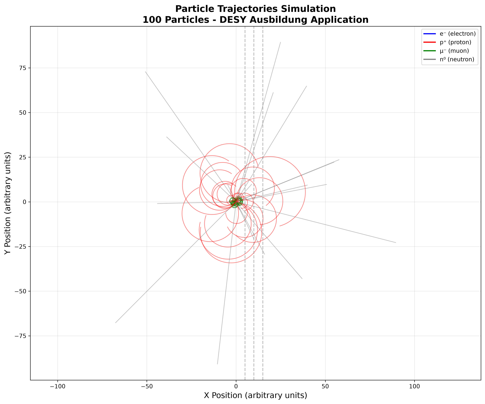
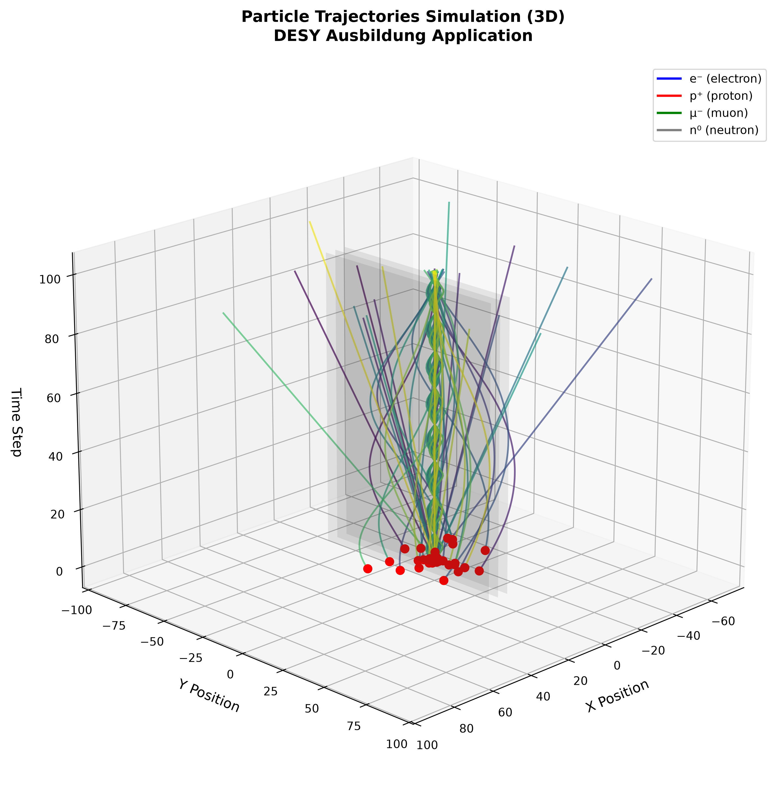
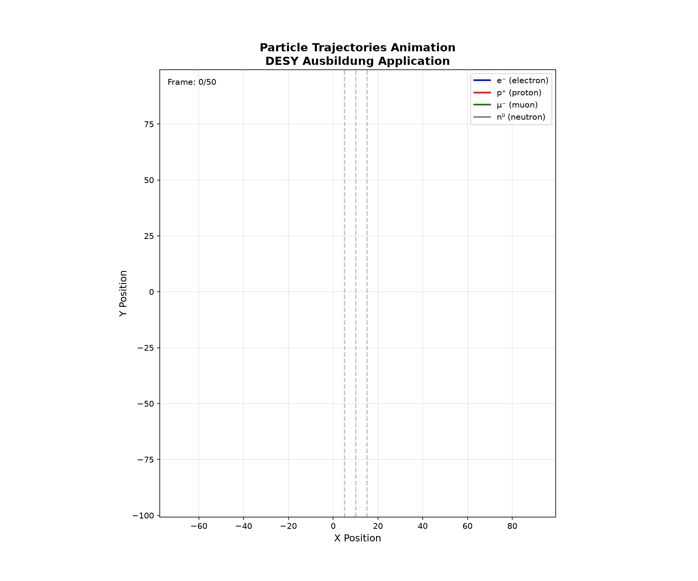

# 🔬 Particle Track Simulator

A particle trajectory simulator in magnetic fields, developed for the **DESY Ausbildung** application (Deutsches Elektronen-Synchrotron).


---

## 📖 Description

This project simulates the motion of charged particles (electrons, protons, muons) under the influence of a **magnetic field**, applying the **Lorentz force**. Charged particles curve in circular trajectories, while neutral particles (neutrons) move in straight lines.

### Key Features:
- ✅ Real physics based on Lorentz force: \( \vec{F} = q(\vec{v} \times \vec{B}) \)
- ✅ 4 particle types with unique properties (charge, mass, color)
- ✅ 2D and 3D trajectory visualization
- ✅ Particle motion animation
- ✅ Hit detection on virtual detectors
- ✅ Statistics and data analysis
- ✅ Interactive graphical interface (GUI)

---

## 🎬 Demo

### 2D Visualization


### 3D Visualization


### Animation


---

## ⚙️ Installation

### Requirements:
- Python 3.8 or higher
- pip (Python package manager)

### Steps:

1. **Clone this repository:**
```bash
git clone [https://github.com/aledelriob/particle-track-simulator.git](https://github.com/aledelriob/particle-track-simulator.git)
cd particle-track-simulator
```

2. **Install dependencies:**
```bash
pip install numpy matplotlib
```

3. **Run the simulator:**
```bash
python main.py
```

4. **Or run the GUI:**
```bash
python gui.py
```

---

## 🚀 Usage

### Option 1: Command Line

Run `main.py` to execute the simulation with default configuration:

```bash
python main.py
```

**Output:**
- `output/tracks.png` - 2D plot
- `output/tracks_3d.png` - 3D plot
- `output/animation.gif` - Animation
- `output/data.csv` - Simulation data

### Option 2: Graphical Interface

Run `gui.py` to open the interactive interface:

```bash
python gui.py
```

**You can:**
- Configure number of particles
- Adjust magnetic field strength
- Modify detector positions
- Run simulation
- View 2D/3D plots
- Create animation
- See real-time statistics

---

## 🔬 Physics: Lorentz Force

The **Lorentz force** describes the force experienced by a charged particle in a magnetic field:

\[
\vec{F} = q(\vec{v} \times \vec{B})
\]

Where:
- \( q \) = particle charge
- \( \vec{v} \) = particle velocity
- \( \vec{B} \) = magnetic field

### Curvature Radius:

\[
r = \frac{m \cdot v}{|q| \cdot B}
\]

### Angular Frequency:

\[
\omega = \frac{|q| \cdot B}{m}
\]

**Consequences:**
- Charged particles (+/-) curve in **circles**
- Neutral particles (0) move in **straight lines**
- Radius depends on mass, velocity, charge, and magnetic field

---

## 🎨 Particle Types

| Particle | Symbol | Charge | Mass | Color |
|----------|--------|--------|------|-------|
| Electron | e⁻ | -1 | 0.0005 | Blue |
| Proton | p⁺ | +1 | 1.0 | Red |
| Muon | μ⁻ | -1 | 0.1 | Green |
| Neutron | n⁰ | 0 | 1.0 | Gray |

---

## 📁 Project Structure


particle-track-simulator/
│
├── main.py # Main simulator
├── gui.py # Graphical interface
├── README.md # This file
│
├── output/ # Simulation results
│ ├── tracks.png # 2D plot
│ ├── tracks_3d.png # 3D plot
│ ├── animation.gif # Animation
│ └── data.csv # Exported data
│
└── requirements.txt # Python dependencies

---

## 🛠️ Technologies

- **Python 3.8+** - Programming language
- **NumPy** - Numerical computing
- **Matplotlib** - Visualization and animation
- **Tkinter** - Graphical interface

---

## 👤 Author

**Alejandra del Río B.**

Developed as a project for the **DESY Ausbildung** application (Deutsches Elektronen-Synchrotron), Hamburg, Germany.

---

## 📧 Contact

- **Email:** [aledelrioba@gmail.com]
- **GitHub:** [aledelriob]

---

## 📄 License

This project is licensed under the MIT License.

---

<div align="center">

**Made with ❤️ for particle physics**

</div>